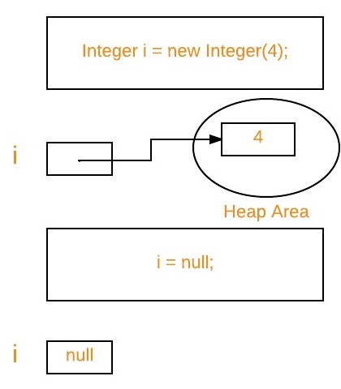

## Garbage Collection in Java

Garbage collection in Java is the process by which Java programs perform automatic memory management(выполняют автоматическое управление памятью). Java programs compile to bytecode that can be run on a Java Virtual Machine, or JVM for short. When Java programs run on the JVM, objects are created on the heap, which is a portion of memory dedicated to the program(часть памяти, выделенную программе). Eventually, some objects will no longer be needed(В конце концов). The garbage collector finds these unused objects and deletes them to free up memory.

## What is Garbage Collection?
In C/C++, a programmer is responsible for both the creation and destruction of objects. Usually, programmer neglects the destruction of useless objects(пренебрегает уничтожению объектов). Due to this negligence(из за этой небрежности), at a certain point(в определенный момент), sufficient (может оказаться) memory may not be available to create new objects, and the entire (вся) program will terminate abnormally(завершиться аварийно), causing OutOfMemoryErrors.

But in Java, the programmer need not care for all those objects which are no longer in use. Garbage collector destroys these objects. The main objective(целью) of Garbage Collector is to free heap memory by destroying unreachable(недоступные) objects. The garbage collector is the best example of the Daemon thread(потока демона) as it is always running in the background. 

## How Does Garbage Collection in Java works?
Java garbage collection is an automatic process. Automatic garbage collection is the process of looking at heap memory, identifying which objects are in use and which are not, and deleting the unused objects. An in-use(используемый) object, or a referenced object, means that some part of your program still maintains a pointer to that object. An unused or unreferenced object is no longer referenced by any part of your program. So the memory used by an unreferenced object can be reclaimed(восстановлена). The programmer does not need to mark(не нужно явно помечать) objects to be deleted explicitly. The garbage collection implementation lives in the JVM. 

## Types of Activities in Java Garbage Collection

Two types of garbage collection activity(операций) usually happen in Java. These are:

1. Minor(инкрементальная) or incremental Garbage Collection: It is said to have occurred(что это произошло) when unreachable objects in the young generation heap memory are removed.
2. Major or Full Garbage Collection: It is said to have occurred when the objects that survived(пережившие) the minor garbage collection are copied into the old generation or permanent generation heap memory are removed. When compared to the young generation, garbage collection happens less frequently in the old generation.


## Important Concepts Related to Garbage Collection in Java

1. `Unreachable(недостижимые) objects:` An object is said to be unreachable if it doesn’t contain any reference to it. Also, note that objects which are part of the island of isolation are also unreachable. 

```Java
Integer i = new Integer(4);
// the new Integer object is reachable  via the reference in 'i' 
i = null;
// the Integer object is no longer reachable.
```



2. `Eligibility for garbage collection:`(Право на сборку мусора) An object is said to be eligible for GC(garbage collection) if it is unreachable. After i = null, integer object 4 in the heap area is suitable(подходит) for garbage collection in the above image.

## Ways to make an object eligible for Garbage Collector

* Even though the programmer is not responsible for destroying useless objects but it is highly recommended to make an object unreachable(thus eligible for GC) if it is no longer required.
* There are generally four ways to make an object eligible for garbage collection.
1. Nullifying the reference variable
2. Re-assigning the reference variable
3. An object created inside the method
4. Island of Isolation

## Ways for requesting JVM to run Garbage Collector

* Once we make an object eligible(пригодный) for garbage collection, it may not destroy immediately by the garbage collector. Whenever JVM runs the Garbage Collector program, then only the object will be destroyed. But when JVM runs Garbage Collector, we can not expect(мы не можем этого ожидать).

* We can also request JVM to run Garbage Collector. There are two ways to do it : 
    1. Using System.gc() method: System class contain static method gc() for requesting JVM to run Garbage Collector.
    2. Using Runtime.getRuntime().gc() method: Runtime class allows the application to interface with the JVM in which the application is running. Hence by using its gc() method, we can request JVM to run Garbage Collector.
    3. There is no guarantee that any of the above two methods will run Garbage Collector.
    4. The call System.gc() is effectively equivalent to the call : Runtime.getRuntime().gc()

`Finalization`
* Just before destroying an object, Garbage Collector calls finalize() method on the object to perform cleanup activities. Once finalize() method completes, Garbage Collector destroys that object.
* finalize() method is present in Object class with the following prototype.

```Java
protected void finalize() throws Throwable
```

protected void finalize() throws Throwable
Based on our requirement, we can override finalize() method for performing our cleanup activities like closing connection from the database. 

1. The finalize() method is called by Garbage Collector, not JVM. However, Garbage Collector is one of the modules of JVM.
2. Object class finalize() method has an empty implementation. Thus, it is recommended to override the finalize() method to dispose of system resources or perform other cleanups.
3. The finalize() method is never invoked more than once for any object.
4. If an uncaught exception is thrown by the finalize() method, the exception is ignored, and the finalization of that object terminates.

## Advantages of Garbage Collection in Java

The advantages of Garbage Collection in Java are:

* It makes java memory-efficient because the garbage collector removes the unreferenced objects from heap memory.
* It is automatically done by the garbage collector(a part of JVM), so we don’t need extra effort.
