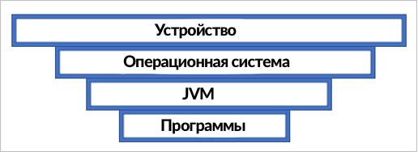
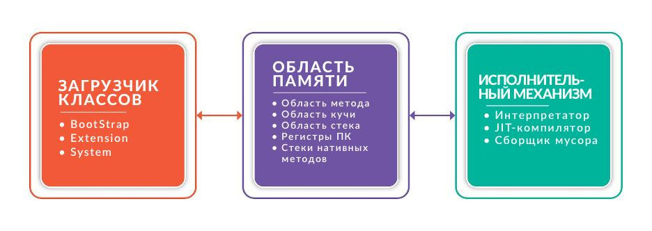

## Что такое виртуальная машина Java (JVM)

Виртуальная машина Java («Java Virtual Machine» — JVM) — это основная часть платформы Java Runtime Environment (JRE), которая интерпретирует байт-код Java для запуска программ.

Одним из наиболее значительных преимуществ использования является использование JVM для запуска программы Java в любой операционной среде.

В её основе реализуется принцип WORA (Write once, run anywhere — «написал один раз, запускай везде»), который сильно упростил процессы разработки.

## Что делает виртуальная машина Java

JVM выполняет две основные функции:

* позволяет запускать Java-программы на любом устройстве или в любой операционной системе;
* даёт доступ к управлению памятью программ и её оптимизации.

JVM образует слой между операционной системой и программами Java.

Это означает, что скомпилированная Java-программа будет связываться с Java Virtual Machine, а JVM будет общаться с операционной системой, являясь своего рода посредником между скомпилированными файлами классов и операционной системой.

## Файл .class и байт-код

Когда дело доходит до выполнения программы, главное, что интересует виртуальную машину Java — это определённый формат файла – .class.

Файлы классов содержат наполовину скомпилированный код, называемый байт-кодом, который в свою очередь предоставляет JVM инструкции, таблицу символов и другую вспомогательную информацию

## Архитектура виртуальной машины Java

Понять, что такое виртуальная машина Java, будет немного проще, если познакомиться с её архитектурой и тем, как она работает. Поэтому важно рассмотреть строение JVM и особенности её частей.

Java Virtual Machine состоит из трёх отдельных компонентов:

* загрузчик классов;
* область памяти;
* исполнительный мeханизм.

