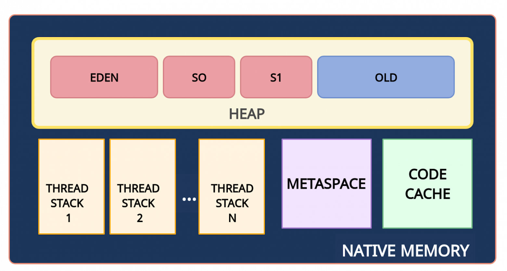
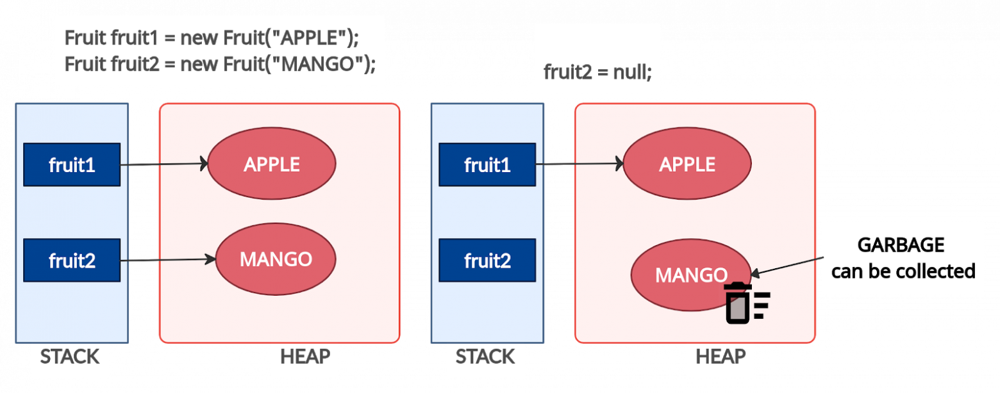
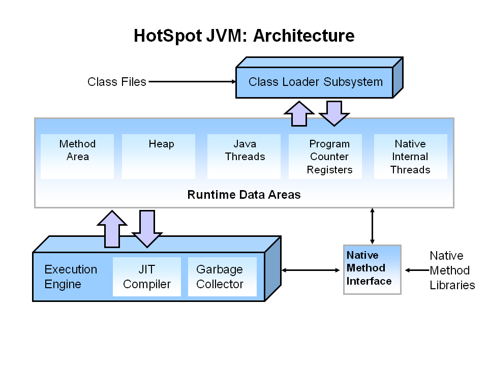
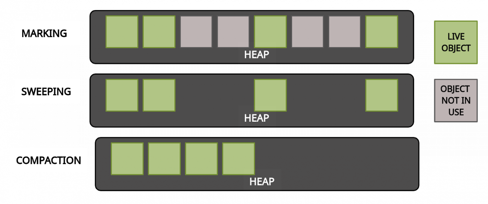
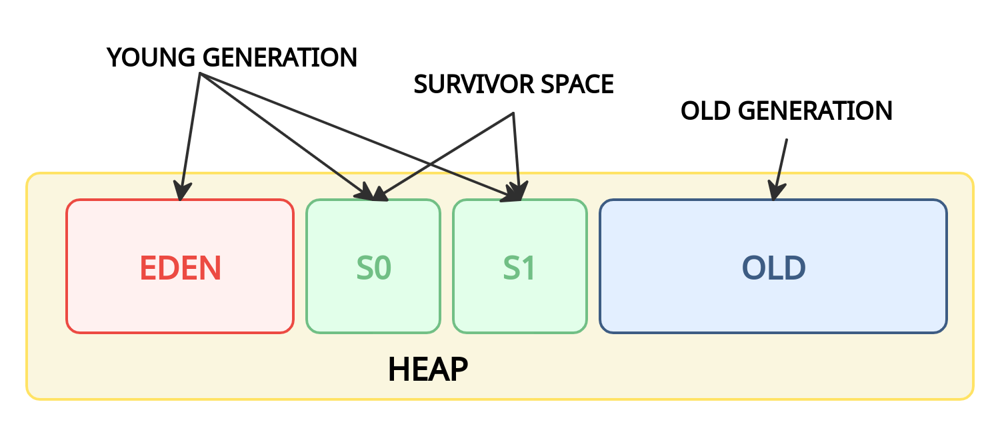
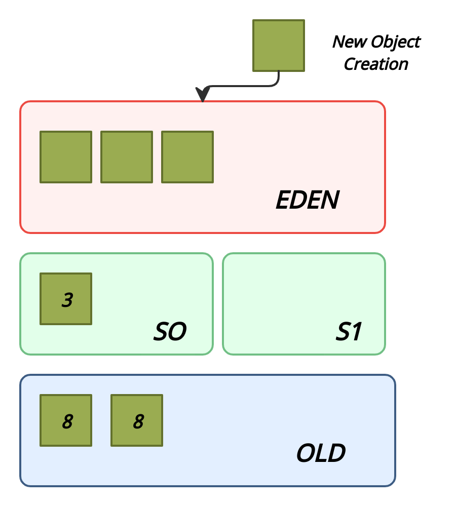

## Структура памяти Java

Память в Java состоит из следующих областей:

`Native Memory` — вся доступная системная память.

`Heap (куча)` — часть native memory, выделенная для кучи. Здесь JVM хранит объекты. Это общее пространство для всех потоков приложения. Размер этой области памяти настраивается с помощью параметра -Xms (минимальный размер) и -Xmx (максимальный размер).

`Stack (стек)` — используется для хранения локальных переменных и стека вызовов метода. Для каждого потока выделяется свой стек.

`Metaspace (метаданные)` — в этой памяти хранятся метаданные классов и статические переменные. Это пространство также является общими для всех. Так как metaspace является частью native memory, то его размер зависит от платформы. Верхний предел объема памяти, используемой для metaspace, можно настроить с помощью флага MaxMetaspaceSize.

`PermGen` (Permanent Generation, постоянное поколение) присутствовало до Java 7. Начиная с Java 8 ему на смену пришла область Metaspace.

`CodeCache (кэш кода)` — JIT-компилятор компилирует часто исполняемый код, преобразует его в нативный машинный код и кеширует для более быстрого выполнения. Это тоже часть native memory.

## Сборка мусора: введение

Что такое "мусор"? Мусором считается объект, который больше не может быть достигнут по ссылке из какого-либо объекта. Поскольку такие объекты больше не используются в приложении, то их можно удалить из памяти.

Например, на диаграмме ниже объект fruit2 может быть удален из памяти, поскольку на него нет ссылок.

Что такое сборка мусора? Сборка мусора — это процесс автоматического управления памятью. Освобождение памяти (путем очистки мусора) выполняется автоматически специальным компонентом JVM — сборщиком мусора (Garbage Collector, GC). Нам, как программистам, нет необходимости вмешиваться в процесс сборки мусора.

## Сборка мусора: процесс

Для сборки мусора используется алгоритм пометок (Mark & Sweep). Этот алгоритм состоит из трех этапов:

1. `Mark (маркировка)`. На первом этапе GC сканирует все объекты и помечает живые (объекты, которые все еще используются). На этом шаге выполнение программы приостанавливается. Поэтому этот шаг также называется "Stop the World" .

2. `Sweep (очистка)`. На этом шаге освобождается память, занятая объектами, не отмеченными на предыдущем шаге.

3. `Compact (уплотнение)`. Объекты, пережившие очистку, перемещаются в единый  непрерывный блок памяти. Это уменьшает фрагментацию кучи и позволяет проще и быстрее размещать новые объекты.

## Поколения объектов

Для оптимизации сборки мусора память кучи дополнительно разделена на четыре области. В эти области объекты помещаются в зависимости от их возраста (как долго они используются в приложении).

1. `Young Generation (молодое поколение)`. Здесь создаются новые объекты. Область young generation разделена на три части раздела: Eden (Эдем), S0 и S1 (Survivor Space — область для выживших).

2. `Old Generation (старое поколение)`. Здесь хранятся давно живущие объекты.

## Что такое Stop the World?
Когда запускается этап mark, работа приложения останавливается. После завершения mark приложение возобновляет свою работу. Любая сборка мусора — это "Stop the World".

## Что такое гипотеза о поколениях?

Как уже упоминалось ранее, для оптимизации этапов mark и sweep используются поколения. Гипотеза о поколениях говорит о следующем:

1. Большинство объектов живут недолго.

2. Если объект выживает, то он, скорее всего, будет жить вечно.

3. Этапы mark и sweep занимают меньше времени при большом количестве мусора. То есть маркировка будет происходить быстрее, если анализируемая область небольшая и в ней много мертвых объектов.

Таким образом, алгоритм сборки мусора, использующий поколения, выглядит следующим образом:

1. Новые объекты создаются в области Eden. Области Survivor (S0, S1) на данный момент пустые.

2. Когда область Eden заполняется, происходит минорная сборка мусора (Minor GC). Minor GC — это процесс, при котором операции mark и sweep выполняются для young generation (молодого поколения).

3. После Minor GC живые объекты перемещаются в одну из областей Survivor (например, S0). Мертвые объекты полностью удаляются.

4. По мере работы приложения пространство Eden заполняется новыми объектами. При очередном Minor GC области young generation и S0 очищаются. На этот раз выжившие объекты перемещаются в область S1, и их возраст увеличивается (отметка о том, что они пережили сборку мусора).

5. При следующем Minor GC процесс повторяется. Однако на этот раз области Survivor меняются местами. Живые объекты перемещаются в S0 и у них увеличивается возраст. Области Eden и S1 очищаются.

6. Объекты между областями Survivor копируются определенное количество раз (пока не переживут определенное количество Minor GC) или пока там достаточно места. Затем эти объекты копируются в область Old.

7. Major GC. При Major GC этапы mark и sweep выполняются для Old Generation. Major GC работает медленнее по сравнению с Minor GC, поскольку старое поколение в основном состоит из живых объектов.

## Преимущества использования поколений

Minor GC происходит в меньшей части кучи (~ 2/3 от кучи). Этап маркировки эффективен, потому что область небольшая и состоит в основном из мертвых объектов.

## Недостатки использования поколений

В каждый момент времени одно из пространств Survivor (S0 или S1) пустое и не используется.
