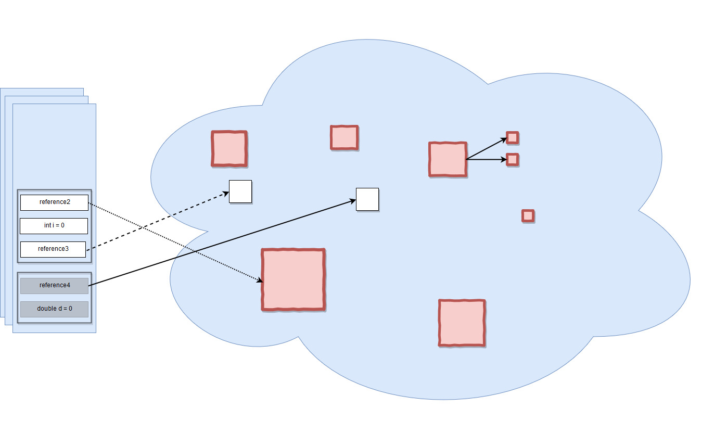

## Процесс сборки мусора

<small>Объекты, подходящие для сборки мусора</small>

Например, все объекты, отмеченные красным цветом, могут быть собраны сборщиком мусора
 Вы можете заметить, что в куче есть объект, который имеет строгие ссылки на другие объекты, которые также находятся в куче (например, это может быть список, который имеет ссылки на его элементы, или объект, имеющий два поля типа, на которые есть ссылки). Однако, поскольку ссылка из стека потеряна, к ней больше нельзя получить доступ, так что это тоже мусор.
 