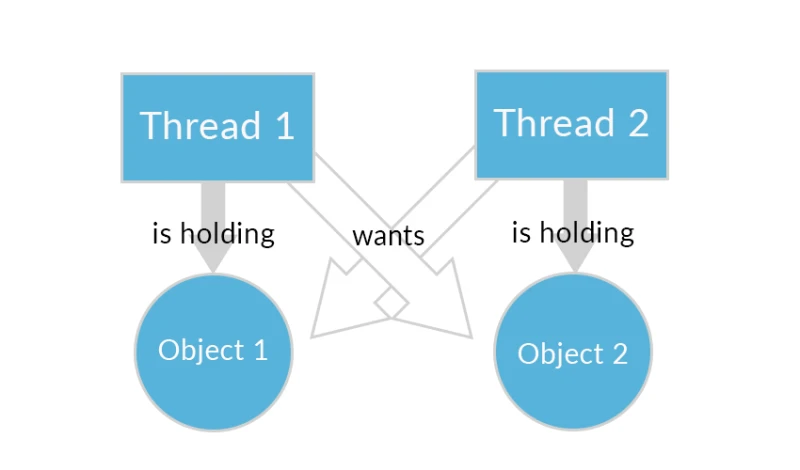

## Проблемы, которые решает многопоточность в Java

По сути, многопоточность Java была придумана, чтобы решить две главные задачи:

1. Одновременно выполнять несколько действий.
В примере выше разные потоки (т.е. члены семьи) параллельно выполняли несколько действий: мыли посуду, ходили в магазин, складывали вещи.
Можно привести и более «программистский» пример. Представь, что у тебя есть программа с пользовательским интерфейсом. При нажатии кнопки «Продолжить» внутри программы должны произойти какие-то вычисления, а пользователь должен увидеть следующий экран интерфейса. Если эти действия осуществляются последовательно, после нажатия кнопки «Продолжить» программа просто зависнет. Пользователь будет видеть все тот же экран с кнопкой «Продолжить», пока все внутренние вычисления не будут выполнены, и программа не дойдет до части, где начнется отрисовка интерфейса.
Что ж, подождем пару минут!
А еще мы можем переделать нашу программу, или, как говорят программисты, «распараллелить». Пусть нужные вычисления выполняются в одном потоке, а отрисовка интерфейса — в другом. У большинства компьютеров хватит на это ресурсов. В таком случае программа не будет «тупить», и пользователь будет спокойно переходить между экранами интерфейса не заботясь о том, что происходит внутри. Одно другому не мешает :)
2. Ускорить вычисления.
Тут все намного проще. Если наш процессор имеет несколько ядер, а большинство процессоров сейчас многоядерные, список наших задач могут параллельно решать несколько ядер. Очевидно, что если нам нужно решить 1000 задач и каждая из них решается за секунду, одно ядро справится со списком за 1000 секунд, два ядра — за 500 секунд, три — за 333 с небольшим секунды и так далее.

## Проблемы, которые создает многопоточность

Есть две конкретные проблемы, которые может вызвать использование многопоточности — взаимная блокировка (deadlock) и состояние гонки (race condition).

Deadlock — ситуация, при которой несколько потоков находятся в состоянии ожидания ресурсов, занятых друг другом, и ни один из них не может продолжать выполнение

Поток-1 работает с каким-то Объектом-1, а поток-2 работает с Объектом-2. При этом программа написана так:

1. Поток-1 перестанет работать с Объектом-1 и переключится на Объект-2, как только Поток-2 перестанет работать с Объектом 2 и переключится на Объект-1.
2. Поток-2 перестанет работать с Объектом-2 и переключится на Объект-1, как только Поток-1 перестанет работать с Объектом 1 и переключится на Объект-2.

Даже не обладая глубокими знаниями в многопоточности ты легко поймешь, что ничего из этого не получится. Потоки никогда не поменяются местами и будут ждать друг друга вечно.

Состояние гонки — ошибка проектирования многопоточной системы или приложения, при которой работа системы или приложения зависит от того, в каком порядке выполняются части кода.

A теперь представь, что программа отвечает за работу робота, который готовит еду!

`Поток-0 достает яйца из холодильника.
Поток-1 включает плиту.
Поток-2 достает сковородку и ставит на плиту.
Поток-3 зажигает огонь на плите.
Поток-4 выливает на сковороду масла.
Поток-5 разбивает яйца и выливает их на сковороду.
Поток-6 выбрасывает скорлупу в мусорное ведро.
Поток-7 снимает готовую яичницу с огня.
Поток-8 выкладывает яичницу в тарелку.
Поток-9 моет посуду.`

Посмотри на результаты работы нашей программы:

`Выполнен поток Thread-0
Выполнен поток Thread-2
Выполнен поток Thread-1
Выполнен поток Thread-4
Выполнен поток Thread-9
Выполнен поток Thread-5
Выполнен поток Thread-8
Выполнен поток Thread-7
Выполнен поток Thread-3
Выполнен поток Thread-6`

При малейшем нарушении последовательности наша кухня превращается в ад, а сошедший с ума робот крушит все вокруг себя. Это тоже распространенная проблема в многопоточном программировании.